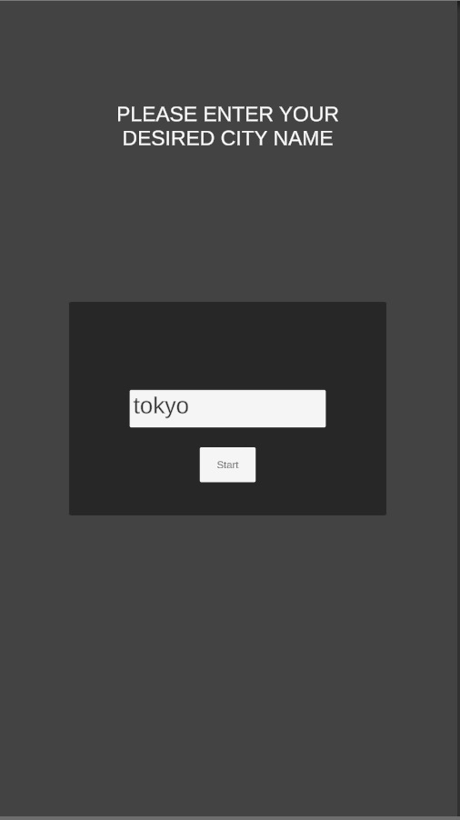
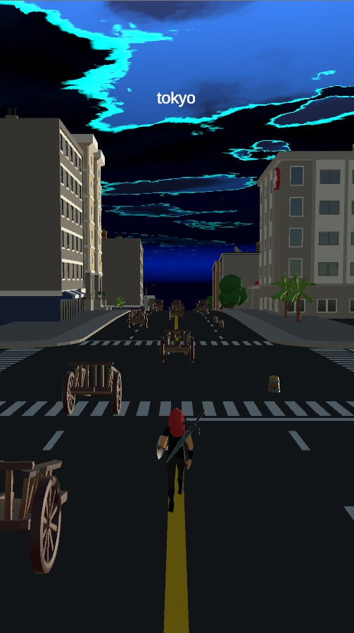
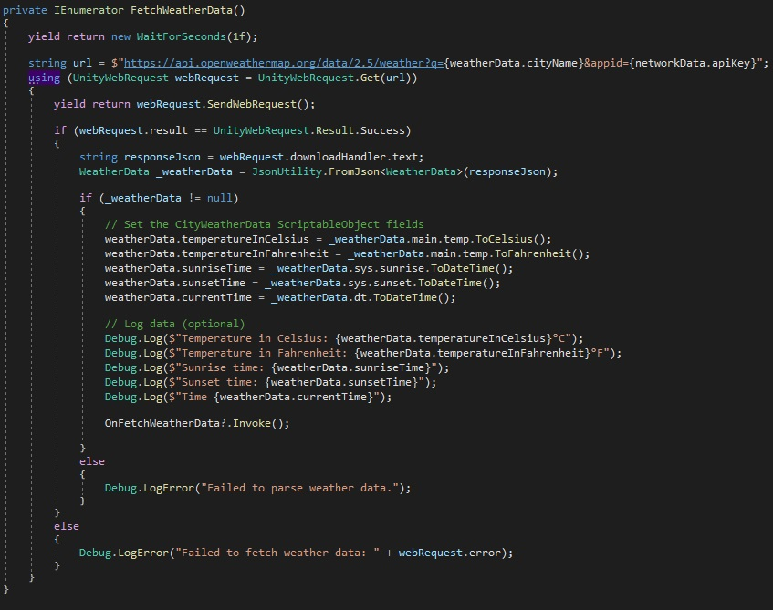

# chrono-chase

## Overview
Take control of your fearless runner as you dash through stunning landscapes where the weather and time shift randomly, altering the terrain and presenting you with ever-changing obstacles

## Table of Contents
- [Screenshots](#screenshots)
- [Demo](#demo)
- [Features](#features)
- [How It Works](#how-it-works)
- [Installation](#installation)
- [Usage](#usage)

## Screenshots
  

## Demo

## Features
- This project is mainly for how UnityWebRequest API works and how external javascript code or custom plugins can be integrated into Unity architecture.
- New swipe control using Unity's new Input System and Input Action data.
- Fully customizable skybox shader.
- Event signaling architecture for loose coupling. Open a scene drag the player prefab and everything starts to work with no errors.

## How It Works
The game initially asks you to enter a city name. As seen in this screenshot, it sends a request to the "weatherapi" endpoint regarding the entered city. Afterwards, the sunset and sunrise data are compared with the current time and the relevant changes are made in the skybox component I have prepared (day or night). 

## Installation
```bash
# Clone the repository

# Open the project in Unity
# Make sure you have Unity installed.

# Configure any necessary settings, assets, or external dependencies.
